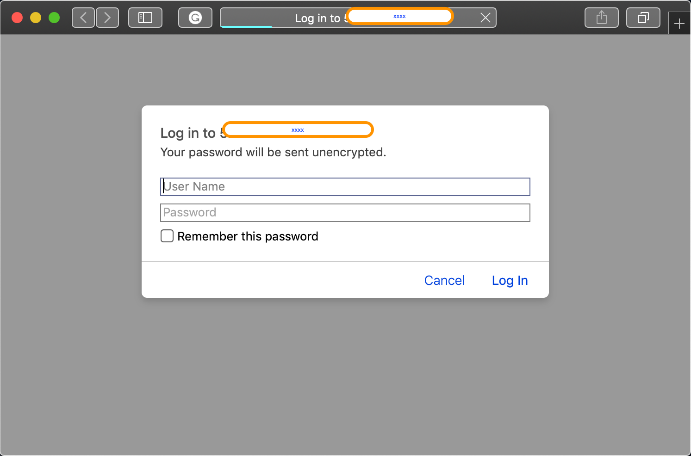

# Introduction-to-k8s-ingress-control

A gentle introduction to [ingress-control](https://kubernetes.io/docs/concepts/services-networking/ingress/) in Kubernetes Clusters

## Ingress Controller

The concept of an `ingress-controller` is used to route traffic with layer 7 load balancing. It provides finer level of granularities in terms of load balacing and splitting traffic among multiple exposed deployments. 

It also can provide an extra layer of security with SSL termination and password enforcement.

Note: the diagram above is for illustration purposes. The user traffic does not actually go thru the K8s service or the kube-proxy. It is routed based on the information specified in the K8s services and enforced by the Kube-proxy, e.g. using IP tables rules (in IPtables mode).

## The Ingress-Controller Configuration

There are [multiple implementations](https://kubernetes.io/docs/concepts/services-networking/ingress-controllers/) of the ingress-controller, including [Traefik](https://docs.traefik.io/providers/kubernetes-ingress/), [HAProxy](https://www.haproxy.com/documentation/hapee/1-9r1/installation/kubernetes-ingress-controller/), [Ambassador](https://www.getambassador.io/) and [Istio](https://istio.io/docs/tasks/traffic-management/ingress/kubernetes-ingress/).

We will use the [nginx-ingress-controller](https://github.com/kubernetes/ingress-nginx)

We will place the controller in its own [namespace](ingress-controller/namespace.yaml) depicted in the right hand side diagram of the [figure above](#The-Ingress-Controller-Configuration) (ingress-namespace)

The controller is installed as a K8s [deployment](ingress-controller/ingress-controller.yaml).

The ingress-controller takes its configuration [parameters](https://kubernetes.github.io/ingress-nginx/user-guide/nginx-configuration/configmap/) from a [configmap](ingress-controller/configmap.yaml). When the map's data is empty, [default](https://kubernetes.github.io/ingress-nginx/user-guide/nginx-configuration/configmap/#configuration-options) values are used.

The ingress controller needs access to certain clusters resources such as `Ingresses`, `Services`, `Secrets` etc, possibly in multiple namespaces. We grant it this access using a [clusterrole](RBAC/clusterrole.yaml), a [clusterrolebinding](RBAC/clusterrole-binding.yaml) and a [serviceaccount](ingress-controller/service-account.yaml).

## The Applications in our Cluster

To illustrate the functionality of the `ingress-controller` we will use simple deployments of http-servers (using nginx, since it is simple to configure). We will have four `deployments` simulating different web-applications (`green`, `yellow`, `red`, `default`).

By default, the traffic that does not match a rule is routed to a service called `default-http-backend` in the same namespace where the ingress resource is created, therefore we create the default nginx [deployment and the service](web-applications/default.yaml) abstracting it. This is mainly to customize the handling of `404` errors.

One of the easiest ways to configure the index page in an nginx server is to use `configmaps` and pass `html` code as raw data. And example of such configuration for a `green` deployment is shown [here](web-applications/green.yaml). This configuration will result in the following webpage:

We will deploy our applications in the `applications-namespace` depicted in the left hand side of the [figure above](#The-Ingress-Controller-Configuration).

## The Ingress resources

We will use two `ingress` resources. The [first one](ingress-resources/ingress-resource.yaml) implements a simple path based routing to the `yellow` and `green` services. The default backend routes traffic to a service called `default-http-backend` in the same namespace.

The [second ingress](ingress-resources/ingress-resource-auth.yaml) requires basic authentication (user/password) to route traffic to the `red` http-server. As a result, it prompts the user to enter the user/password information. This information should match the one stored in a [secret](ingress-resources/secret-auth.yaml) referred to by the [ingress resource](ingress-resources/ingress-resource-auth.yaml).

using the [second ingress](ingress-resources/ingress-resource-auth.yaml), you will be prompted for a username/password:

once entered, you will get to the `red` webpage.

## Final Remark

Configuring a cloud load balancer and registering your website's name in a public DNS server is outside the scope of this document.
